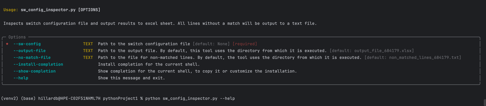
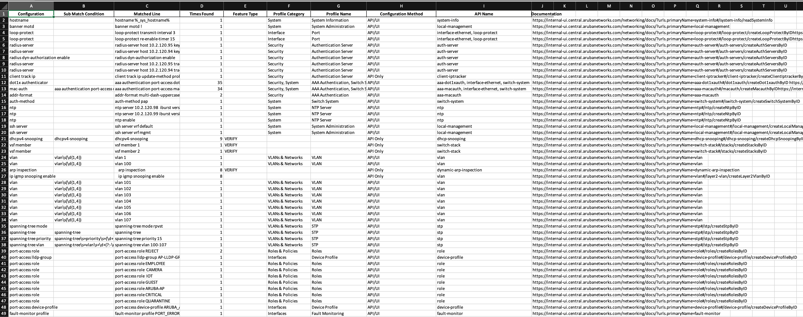
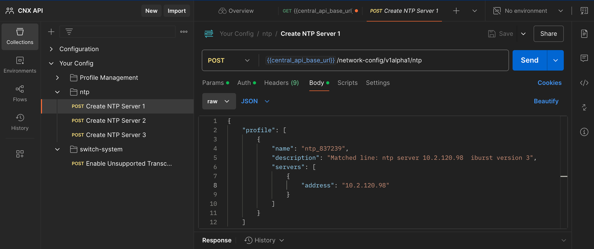

This tool will inspect the switches configuration and identify if the configuration is supported in the UI/API or API only.  Switch configuration files MUST be text files to run this tool.  

To run this tool the following packages must be installed typer, re, json, pandas, random. Requirements file can be ran with the following:

```
pip install -r requirments.txt
```

Once the requirements are installed you can run the tool by using the following command:

```
 python sw_config_inspector.py config-inspector --sw-config sw_config.txt
```

 For additional help you can also use the following help command. 
```
 python sw_config_inspector.py --help
```


After the tool runs there will be 2 output files. One file will be an excel sheet which will include the following, Configuration method, Profile Category, Profile name, API Name and API Documentation. 

The second file will be CLI lines that could not be matched. CLI lines that do not have a match simply means there is not an entry in the "feature_dictionary.json" database.  This feature may or may not be supported or there is limited information on this feature at this time. 

example output below:



# Postman Collection Generator (BETA)

Also included in this script, is a Postman generation command. This command will read switch configurations and generate a customized Postman collection.  This is a proof of concept script and has limited support at this time. 

Use the following command to generate your own customized Postman Collection. By default, the collection file will generate in the directory the command was executed. This can be changed to any location. Ensure that this is a switch configuration file NOT a template file.

```
 python sw_config_inspector.py create-collection --sw-config sw_config.txt
```

Example collection below:  




Tool Deep Dive:
[migration Almost Final.mp4](media/migration_Almost_Final.mp4)


<video width="320" height="240" controls>
  <source src="media/migration_Almost_Final.mp" type="video/mp4">
</video>


